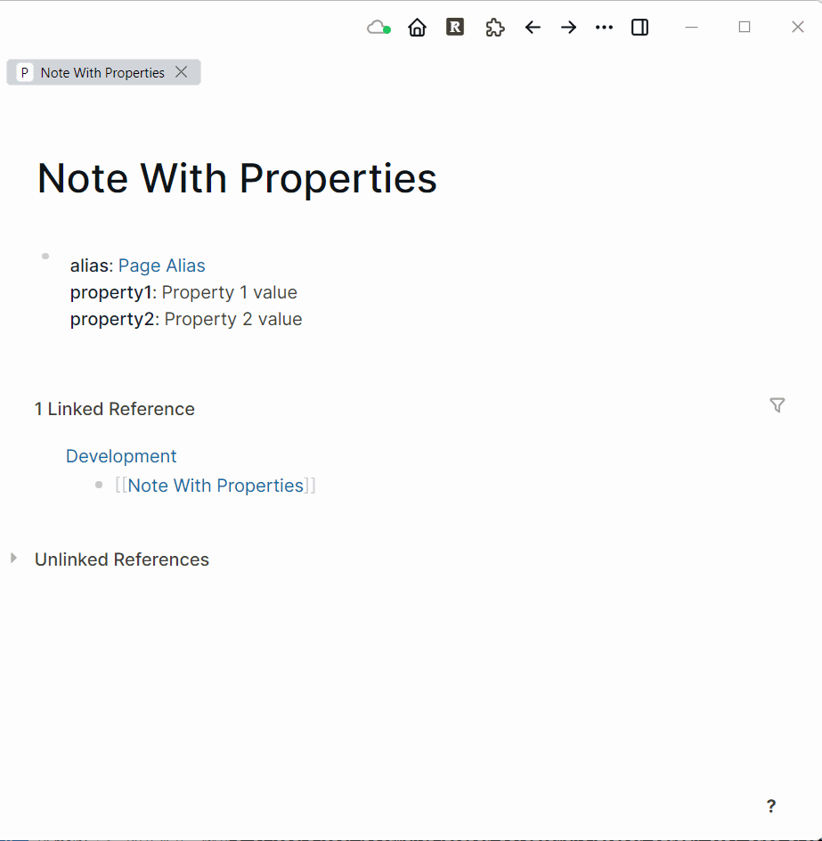

# logseq-plugin-copy-page-properties

Create a new page and copy the current page properties over to the new page.

# How to use

The plugin adds two options/commands to each the block context menu and slash commands:

## Copy page properties to new page

Create a new page and copy the page properties from the current page to the new page (with the exception of the `alias` property).  Focus is left on the new page.  Rename the page name used to create the page (a timestamp) to you own page name.

## Copy page properties to linked page

Copy the current page properties (with the exception of the `alias` property) to the first linked page in the block (i.e., page enclosed by `[[ ... ]]`).  Focus is left on the linked page.

# In action
